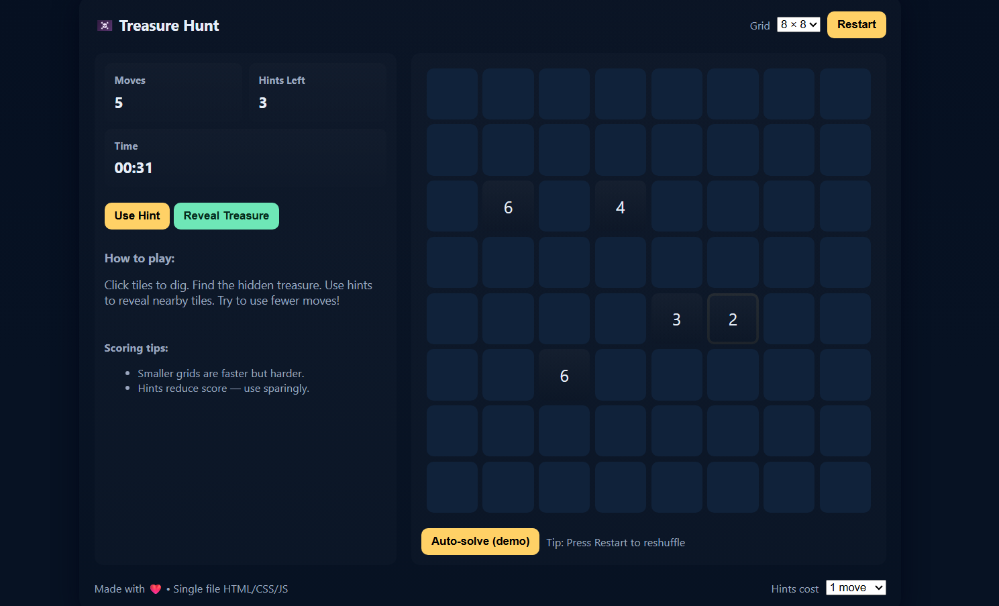

# 🏴‍☠️ Treasure Hunt Game

A simple and fun **Treasure Hunt Game** built using **HTML, CSS, and JavaScript**.  
Click around the map to find the hidden treasure — fewer clicks means a higher score!  

---

## 🚀 Features
- Interactive treasure hunting map  
- Random treasure location every game  
- Click counter to track attempts  
- Simple UI with restart option  
- Pure **HTML, CSS, JS** (no frameworks)

---

## 🎮 How to Play
1. Open the game in your browser.  
2. Click anywhere on the map to make a guess.  
3. Hints will guide you ("Hot", "Cold", etc.) based on distance.  
4. Keep guessing until you find the treasure!  
5. Try to win in the least number of clicks possible.  

---

## 🛠️ Installation
Clone the repo to your local machine:

```bash
git clone https://github.com/Avinash-Singh-13/Treasure-Hunt-Game.git
```
## Navigate into the project folder:
```
cd Treasure-Hunt-Game
```

## Run the game by opening index.html in your browser.
```
📂 Project Structure
Treasure-Hunt-Game/
│── index.html       # Main game file
│── style.css        # Game styling
│── script.js        # Game logic
└── README.md        # Project documentation
```
## 📸 Screenshot
```

(Add a screenshot of your game here — you can upload an image in your repo and link it like below)


```
